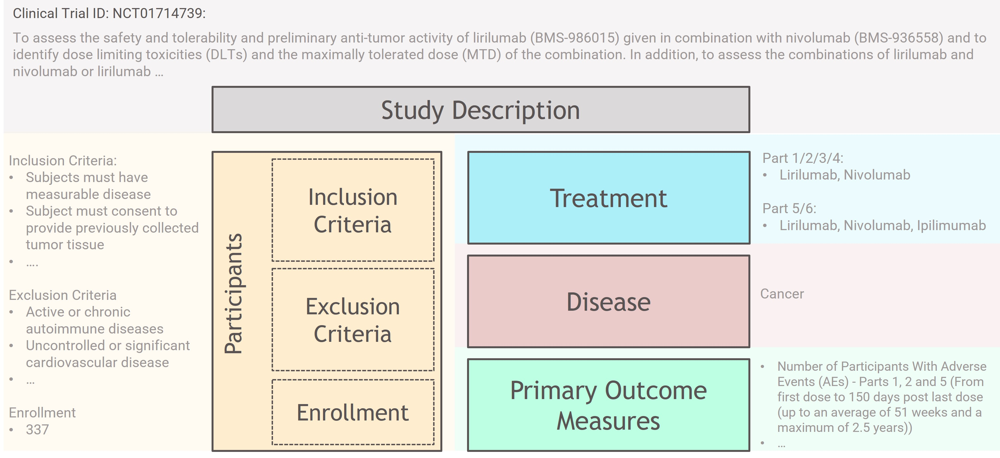

<h1 align="center">TrialDuraPredict</h1>

<i>Predicting and Interpreting Clinical Trial Duration Using Machine Learning to Enhance Trial Design</i>

## Table of Contents
- [Description](#description)
- [Getting Started](#getting-started)
- [Contact](#contact)
- [Acknowledgments](#acknowledgments)

## Description
This project is meant to develop machine learning methods to predict clinical trial duration based on registered study information including study description, enrollment, study type, eligibility criteria, study plan, start date, and so on. Simultaneously, we seek to understand the contributions of various features learned by the model to prolonged trial durations and provide recommendations to optimize study protocols and appropriately reduce trial duration.
Since many clinical trials are performed and they are lengthy with increasing costs as time goes on, any improvement in design protocols would allow for more efficient trials, with faster phases and even follow up studies, to be performed. Markey et al. (2024) have noted many external factors such as regulatory changes and increasing competitive pressures, which in turn may have a hand in unnecessarily increasing the overall complexity of these trials. With this in mind, we can use our project to help with assessing what makes for faster and cheaper turnarounds that do not sacrifice the scientific method so that interventional treatments can more swiftly be tested and released that may drastically improve healthcare outcomes.

## Getting Started
### Installation
- Clone the repo `git clone https://github.com/TrialDuraPredict/TrialDuraPredict`, and go to repo dir `cd TrialDuraPredict`
- Create a virtual environment `virtualenv venv`, and activate it `source venv/bin/activate`
- Install packages `pip install -r requirements.txt`

This installation is designed for macOS or Linux. Please adjust the commands accordingly if you are using Windows.

### Raw Data
The raw data in JSON format can be downloaded from [ClinicalTrial.gov](https://clinicaltrials.gov/data-api/how-download-study-records). The dataset for this project, dated July 1st, 2024, comprises 500,534 study records. Each record provides comprehensive information about the trial, including NCT ID (study identifiers), study description, participant enrollment (inclusion/exclusion criteria), treatment or intervention methods, disease or condition being studied, outcome measures, among others. Below is a brief overview of the key information used to predict the duration of the trial.\
\

### Data Cleaning
We use example data for this tutorial, which includes 1000 studies in *./data_example/ctg-studies.json*. Firstly direct to *TrialDuraPredict* folder,
- To generate the **training**, **test** and **incompleted** study IDs , run the code `python ./src/study_ids_split.py`. Datasets including separate study IDs are generated in *./data_example/*
- To generate the **clinical duration** (output, Months as unit), run the code `python ./src/trial_duration.py`. Duration dataset is generated in *./data_example/trial_duration.csv*
- To generate the embedding of **clinical description**, run the code `python ./src/description2embedding.py`. The embedding dataset is generated in *./data_example/description2embedding.pkl*
- To generate the embedding of **inclusion_eligibility** and **exclusion_eligibility**, run the code `python ./src/eligibility2embedding.py`. The embedding dataset is generated in *./data_example/eligibility2embedding.pkl*
- To generate the embedding of **treatment**, run the code `python ./src/treatment2embedding.py`. The embedding dataset is generated in *./data_example/treatment2embedding.pkl*
- To generate the embedding of **disease**, run the code `python ./src/disease2embedding.py`. The embedding dataset is generated in *./data_example/disease2embedding.pkl*
- To generate the embedding of **outcome measures**, run the code `python ./src/outcome2embedding.py`. The embedding dataset is generated in *./data_example/outcome2embedding.pkl*

Once these have all been completed, combine together into one dataset found in *./data_example/embeddings_df.pkl* using the code `python ./src/combine_embedding_dfs.py`.

## Contact
Created by TrialDuraPredict Team. Contact us at: xxx

## Acknowledgments
Inspiration, etc\
[TrialDura](https://arxiv.org/pdf/2404.13235)\
[HINT: clinical trial outcome prediction](https://github.com/futianfan/clinical-trial-outcome-prediction)\
[clinical-trial-prediction](https://github.com/lenlan/clinical-trial-prediction/tree/main)
